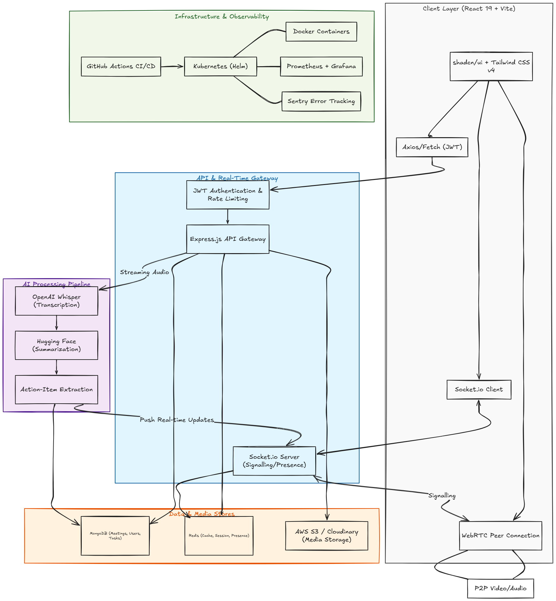

# IntelliMeet - System Design Document

**Project:** IntelliMeet - AI-Powered Enterprise Meeting and Collaboration Platform  
**Version:** 2.0 (Industry Edition)  
**Author:** Zidio Development  
**Date:** April 2026

---

## 1. System Overview

IntelliMeet is a production-grade MERN full-stack application that combines real-time video meetings, AI-powered meeting intelligence (transcription, summaries, action items), team chat, task management, and analytics. It is designed for modern remote and hybrid teams and targets 500-5,000 concurrent meeting participants with 99.95% uptime.

### Key Business Goals

- Reduce meeting follow-up time by 40-60% through AI summaries and automatic action items.
- Improve team productivity by 25-40% with real-time collaboration and task tracking.
- Support 10k+ concurrent meetings with horizontal scaling and zero-downtime deployments.

---

## 2. High-Level Architecture



*Generate using Excalidraw, Draw.io, or similar. See the description below.*

### Architecture Layers

| Layer | Components |
|-------|------------|
| Client | React 19 + JavaScript, Vite, shadcn/ui, Tailwind CSS v4 |
| API Gateway | Express.js REST API (JWT-authenticated) |
| Real-Time | Socket.io (signalling, chat, notifications) + WebRTC (peer-to-peer video/audio) |
| AI Services | OpenAI Whisper (transcription) / Hugging Face (summarisation, action-item extraction) |
| Data Stores | MongoDB (meetings, users, tasks), Redis (session, cache, presence) |
| Media Storage | Cloudinary / AWS S3 (recordings, avatars) |
| DevOps | Docker, Kubernetes (Helm), GitHub Actions, Prometheus + Grafana + Sentry |

### Architecture Description

1. Browser establishes WebRTC peer connections for video/audio, using Socket.io for signalling and room management.
2. Express REST API handles authentication, CRUD for meetings, tasks, teams, and analytics data. All endpoints are protected by JWT and rate-limited.
3. Socket.io server runs as a separate scalable service, or colocated, to manage real-time chat, presence, and AI result push events.
4. AI processing pipeline:
   - Real-time transcription via Whisper using streaming audio chunks.
   - Post-meeting batch jobs generate summaries and action items using Hugging Face or OpenAI models.
   - Results are stored in MongoDB and pushed via Socket.io to meeting participants.
5. Redis caches active sessions, meeting metadata, and presence data for low-latency access.
6. MongoDB stores persistent data such as users, meetings, recordings metadata, tasks, and workspaces.
7. Media storage holds recorded meetings and profile avatars, accessed via signed URLs.
8. Kubernetes orchestrates containers, with HPA scaling based on CPU, memory, and Socket.io connections.

---

## 3. Technology Stack and Rationale

| Category | Technology | Rationale / Alternative |
|----------|------------|-------------------------|
| Frontend | React 19 + JavaScript + Vite | Fast HMR, mature ecosystem, code splitting |
| UI Components | shadcn/ui + Tailwind CSS v4 | Modern, accessible, customisable |
| State Management | TanStack Query + Zustand | Server state vs client state separation |
| Backend API | Node.js + Express | Lightweight, event-driven, good concurrency |
| Database | MongoDB (Mongoose) | Flexible schema for meetings and tasks, good with Node |
| Real-Time Comms | Socket.io + WebRTC | Bidirectional events + peer-to-peer media |
| AI Integration | OpenAI (Whisper) / Hugging Face | Industry-standard STT and NLP summarisation |
| Cache | Redis | Sub-ms latency for sessions, presence, feed cache |
| Authentication | JWT + bcrypt | Stateless, secure, token refresh |
| File Storage | Cloudinary / AWS S3 | Scalable media delivery with CDN |
| Containerisation | Docker multi-stage | Consistent builds, small production images |
| Orchestration | Kubernetes + Helm | Auto-scaling, rolling updates, high availability |
| CI/CD | GitHub Actions | Automated test, build, push, deploy |
| Monitoring | Prometheus + Grafana + Sentry | Metrics, dashboards, error tracking |

---

## 4. Detailed Component Design

### 4.1 Frontend Application

**Key Pages / Routes**

- `/login`, `/signup` - authentication pages
- `/dashboard` - main dashboard with meeting list and analytics widgets
- `/meeting/:id` - video room with chat, participant list, and AI sidebar
- `/meetings/:id/summary` - post-meeting summary, action items, and recording
- `/teams/:id` - workspace with Kanban board and tasks
- `/profile` - user settings and avatar upload

**Component Hierarchy**

```text
App
├─ AuthProvider (context)
├─ SocketProvider (Socket.io client)
├─ Routes
│  ├─ LoginPage / SignupPage
│  ├─ DashboardPage
│  │  ├─ MeetingList
│  │  ├─ UpcomingMeetings
│  │  └─ ProductivityChart
│  ├─ MeetingRoomPage
│  │  ├─ VideoGrid (WebRTC)
│  │  ├─ ChatPanel
│  │  ├─ ParticipantList
│  │  ├─ ScreenShareButton
│  │  └─ AIAssistant (transcript, summary)
│  └─ TeamWorkspacePage
│     └─ KanbanBoard
└─ ...
```

**State Management**

- TanStack Query for server data such as meetings, tasks, and analytics, with caching and refetching.
- Zustand for local UI state such as sidebar open state, chat unread count, and WebRTC connection status.

### 4.2 Backend API

**REST Endpoints (v1)**

| Method | Endpoint | Description | Auth |
|--------|----------|-------------|------|
| POST | `/api/auth/signup` | Register new user | No |
| POST | `/api/auth/login` | Login, returns JWT + refresh token | No |
| POST | `/api/auth/refresh` | Refresh access token | Refresh token |
| GET | `/api/users/me` | Get current user profile | Yes |
| PUT | `/api/users/me` | Update profile (avatar, name) | Yes |
| POST | `/api/meetings` | Create a new meeting | Yes |
| GET | `/api/meetings` | List meetings (filters, pagination) | Yes |
| GET | `/api/meetings/:id` | Get meeting details | Yes |
| PUT | `/api/meetings/:id` | Update meeting settings | Host/Admin |
| DELETE | `/api/meetings/:id` | Cancel meeting | Host/Admin |
| POST | `/api/meetings/:id/join` | Generate join token/credentials | Yes (invitee) |
| GET | `/api/meetings/:id/recordings` | List recorded sessions | Yes |
| POST | `/api/meetings/:id/ai/generate-summary` | Trigger AI summary generation | Host |
| GET | `/api/meetings/:id/ai/summary` | Get latest summary and action items | Yes |
| GET | `/api/teams/:id` | Team workspace data | Yes |
| POST | `/api/teams/:id/tasks` | Create task from action item | Yes |
| GET | `/api/analytics/me` | Personal meeting analytics | Yes |

**WebSocket Events (Socket.io)**

| Event | Direction | Description |
|-------|-----------|-------------|
| `meeting:join` | Client -> Server | Join a meeting room with token |
| `meeting:leave` | Client -> Server | Leave meeting room |
| `signal` | Bidirectional | WebRTC signalling (offer, answer, ICE) |
| `chat:message` | Client -> Server | Send in-meeting message |
| `chat:new-message` | Server -> Client | Broadcast new message to room |
| `chat:typing` | Client -> Server | User typing indicator |
| `participant:update` | Server -> Client | Participant list changed |
| `ai:transcription` | Server -> Client | Partial transcript chunk |
| `ai:summary-ready` | Server -> Client | Final summary and action items available |
| `notification:new` | Server -> Client | Mention or action item assigned |

**AI Integration Flow**

1. Audio streams from WebRTC are sent to the backend via a media server, or directly from the client via WebSocket.
2. The backend forwards chunks to OpenAI Whisper for real-time transcription, and results are emitted to the room.
3. After the meeting ends, a job queues the full transcript for summary generation and action-item extraction.
4. Results are stored in MongoDB and a push notification is sent to participants.

### 4.3 Data Models (MongoDB Schemas)

**User**

```js
{
  _id: ObjectId,
  email: String, // unique
  passwordHash: String,
  name: String,
  avatarUrl: String,
  role: { type: String, enum: ['admin', 'member'] },
  createdAt: Date,
  refreshTokens: [String] // for token rotation
}
```

**Meeting**

```js
{
  _id: ObjectId,
  title: String,
  description: String,
  host: { type: ObjectId, ref: 'User' },
  scheduledAt: Date,
  duration: Number, // planned minutes
  status: { type: String, enum: ['scheduled', 'live', 'ended'] },
  roomId: String, // unique string for WebRTC room
  settings: {
    isRecorded: Boolean,
    allowChat: Boolean,
    muteOnJoin: Boolean
  },
  participants: [{
    user: { type: ObjectId, ref: 'User' },
    joinedAt: Date,
    leftAt: Date
  }],
  aiSummary: {
    transcript: String,
    summary: String,
    actionItems: [{
      description: String,
      assignee: { type: ObjectId, ref: 'User' },
      dueDate: Date,
      taskId: { type: ObjectId, ref: 'Task' }
    }],
    generatedAt: Date
  },
  recordings: [{
    url: String,
    storageKey: String,
    duration: Number,
    createdAt: Date
  }],
  createdAt: Date,
  updatedAt: Date
}
```

**Message (in-meeting chat)**

```js
{
  _id: ObjectId,
  meetingId: { type: ObjectId, ref: 'Meeting' },
  sender: { type: ObjectId, ref: 'User' },
  text: String,
  timestamp: Date,
  type: { type: String, enum: ['text', 'system'] }
}
```

**Task / Action Item**

```js
{
  _id: ObjectId,
  teamId: { type: ObjectId, ref: 'Team' },
  title: String,
  description: String,
  assignee: { type: ObjectId, ref: 'User' },
  status: { type: String, enum: ['todo', 'in-progress', 'done'] },
  dueDate: Date,
  source: { type: String, enum: ['meeting', 'manual'] },
  sourceMeetingId: { type: ObjectId, ref: 'Meeting' },
  createdAt: Date,
  updatedAt: Date
}
```

**Team**

```js
{
  _id: ObjectId,
  name: String,
  members: [{ type: ObjectId, ref: 'User' }],
  workspaceData: Object // Kanban board structure and task references
}
```

### 4.4 Real-Time Infrastructure

**WebRTC Topology**

- Mesh topology for small rooms.
- SFU topology for larger groups.
- In production, an SFU such as Mediasoup or LiveKit should be deployed alongside the Node.js server to handle more than 10 participants efficiently.
- The initial design uses peer-to-peer mesh coordinated by Socket.io signalling, with a planned migration to SFU for scaling.

**Socket.io Scalability**

- Use the Redis adapter to share state across multiple Socket.io server instances.
- Each instance handles a subset of rooms, and client connections are sticky-session routed via Nginx or HAProxy.
- Kubernetes HPA scales Socket.io pods based on connection count and CPU.

**AI Real-Time Pipeline**

- Media streams are captured per peer.
- Audio is mixed server-side, or by a separate media server, and then sent to STT.
- For simplicity, the initial version can transcribe the host's audio only and later support multi-speaker diarisation.

---

## 5. Security Design

### Authentication and Authorisation

- JWT access tokens with short expiry and refresh tokens stored HttpOnly and hashed in the database.
- Role-based access control for Admin and Member is enforced on all protected endpoints.

### Password Security

- bcrypt with salt rounds set to 12.

### End-to-End Encryption

- Optional WebRTC media stream encryption using Insertable Streams or SFrame for enterprise clients.

### API Security

- Rate limiting on `/auth/*` endpoints, for example 5 attempts per IP per minute.
- Input sanitisation and validation with express-validator.
- Helmet.js for secure HTTP headers.
- CORS configured to allow only the frontend domain.

### Data Protection

- MongoDB connection encrypted with TLS.
- Cloudinary or S3 bucket policies restrict public access, with signed URLs for media.
- Secrets such as API keys and database passwords are managed via Kubernetes Secrets or environment variables and are never committed.

### OWASP Mitigations

- XSS prevention through React defaults and DOMPurify for chat.
- CSRF tokens if needed for non-API routes.
- No SQL injection risk, since the system uses MongoDB; NoSQL injection is prevented through Mongoose schema validation and sanitisation.

---

## 6. Scalability and Performance Considerations

### Horizontal Scaling

- Stateless API services are replicated behind a load balancer.
- Socket.io uses Redis for message broadcast across instances.
- MongoDB Atlas or a self-hosted replica set can be used, with read replicas for analytics queries.

### Caching Strategy

- Redis caches meeting details, user sessions, and frequently accessed analytics aggregates.
- TanStack Query on the frontend reduces redundant API calls.

### Media Handling

- Recordings are processed asynchronously using worker queues such as BullMQ to avoid blocking the API.
- Use a CDN for avatar and recording delivery.

### Load Testing Targets

- 10k concurrent meetings.
- Less than 200 ms latency for real-time features.
- Achieved through WebRTC optimisation, SFU adoption, connection pooling, and proper Node.js cluster configuration.

### Auto-Scaling

- Kubernetes HPA metrics on API pods when CPU is greater than 70%.
- Kubernetes HPA metrics on Socket.io pods when connections exceed 500.

---

## 7. Deployment Architecture

### Containerisation

- Multi-stage Docker builds for the frontend, with nginx serving static assets.
- Multi-stage Docker builds for the backend Node.js application.
- Separate containers for the main API, Socket.io server, AI processing worker, Redis, and MongoDB.

### Orchestration

- Kubernetes cluster on AWS EKS or GKE.
- Helm charts for consistent deployments.
- Namespace: `intellimeet-prod`.
- Services: `api-service`, `socket-service`, `ai-worker`, `redis`, `mongo`.

### CI/CD Pipeline (GitHub Actions)

1. Lint and run unit tests.
2. Build Docker images.
3. Push images to a container registry such as Docker Hub or ECR.
4. Update Helm values and deploy to staging.
5. Run smoke tests on staging.
6. Require manual approval for production rollout using zero-downtime rolling updates.

### Environments

- Development: local docker-compose with hot reload.
- Staging: mirror of production on a smaller cluster.
- Production: HA configuration with at least 3 API replicas, 2 Socket.io replicas, Redis Sentinel, and MongoDB replica set.

---

## 8. Monitoring and Observability

| Tool | Purpose |
|------|---------|
| Prometheus | Metrics collection from Node.js via prom-client, MongoDB, Redis, and Socket.io |
| Grafana | Dashboards for API latency, meeting count, active connections, AI queue, and error rates |
| Sentry | Real-time error tracking for frontend and backend |
| Winston + ELK | Optional centralised logging with structured JSON logs |
| Health Checks | `/health` endpoint for liveness and readiness probes |

### Key Metrics to Monitor

- P95 API response time below 200 ms.
- Socket.io connection count and reconnection rate.
- AI job processing time and failure rate.
- Meeting recording upload success rate.

---

## 9. Testing Strategy

- Unit tests: Jest for utility functions, API controllers, and Socket.io event handlers.
- Integration tests: Supertest for API endpoints and MongoDB memory server.
- WebRTC testing: simulated peer connections using wrtc.
- AI pipeline tests: offline testing with sample audio files, with target summary and action item accuracy above 85%.
- Load testing: JMeter or k6 scripts simulating 5,000 users joining meetings concurrently.

---

## 10. Future Roadmap

- Advanced AI: speaker diarisation, sentiment analysis, and meeting search across transcripts.
- Integration ecosystem: calendar sync with Google and Outlook, plus Slack and Teams notifications.
- Mobile apps: React Native for on-the-go meeting participation.
- Enterprise SSO: SAML and OIDC for large organisations.
- Compliance: HIPAA and GDPR data handling for recordings.

---

## 11. Diagrams To Add

The following diagrams should be created using Excalidraw, Draw.io, or Lucidchart and included in the final submission:

- System Architecture Diagram
- Database ER Diagram
- CI/CD Pipeline Flow
- WebRTC Signalling Sequence Diagram

---

## 12. Summary

IntelliMeet is designed as a scalable enterprise collaboration platform that combines real-time communication, AI-driven meeting intelligence, and production-grade deployment practices. The architecture prioritises low-latency collaboration, secure access, horizontal scalability, and operational observability.
